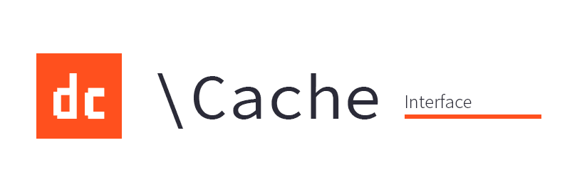

## Installation

```
$ composer install dc/cache
```

Or add it to `composer.json`:

```json
"require": {
	"dc/cache": "0.*",
}
```

```
$ composer install
```

**This package suggests `dc/cache-memcache`, which is the only implementation at this point.**

## Getting started

This is just an interface. You probably should install `dc/cache-memcahe` or write your own implementation to the interface.

When you have, you can use the interface like this:

```php
$cache = new \SomeImplementation();
$cache->set('foo', 'bar');
echo $cache->get('foo'); // prints bar
```

A common pattern is that you want a specific value from the cache, and if it is a cache miss, you want to produce it:

```php
echo $cache->getWithFallback('foo', function() {
  return 'bar';
}); // prints bar
$cache->get('foo'); // now also prints bar
```

This syntax works with any callable, not just closures.

You can also use the return value to determine the validity.

```php
$foo = $cache->getWithFallback("foo", 
    function($x) { return ["foo" => $x, "expires" => \DateInterval($x)]; }, 
    function($result) { return $result["expires"]; });
```